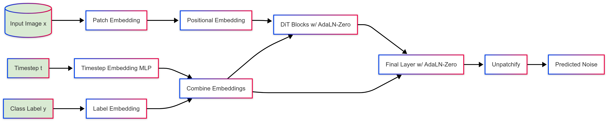

# Diffusion Transformer for Fashion MNIST

A conditional diffusion model based on the Diffusion Transformer (DiT) architecture for generating Fashion MNIST images with classifier-free guidance.

## Model Design



The diagram above shows the architecture of the conditional Diffusion Transformer model. Key components include:

1. **Patch Embedding**: Transforms the input image into a sequence of patch embeddings.
2. **Positional Embedding**: Adds position information to the patch sequence.
3. **Timestep Embedding**: Encodes diffusion timestep information via sinusoidal embeddings and an MLP.
4. **Label Embedding**: Embeds class labels to condition the generation process.
5. **DiT Blocks**: Transformer blocks with AdaLN-Zero conditioning, using the combined timestep and label embeddings.
6. **Final Layer**: Processes the transformer output with adaptive layer normalization.
7. **Unpatchify**: Reconstructs the image from patch embeddings.

This architecture supports classifier-free guidance (CFG) during both training and sampling for improved generation quality and class conditioning.

## Project Structure

```
diffusion_transformer_fmnist/
├── config.py               # Configuration parameters
├── data/                   # Data handling module
│   ├── __init__.py
│   └── dataset.py          # Dataset and dataloader utilities
├── diffusion/              # Diffusion process module
│   ├── __init__.py
│   ├── diffusion_process.py # Forward/backward processes and sampling
│   └── scheduler.py        # Diffusion scheduler and parameters
├── FashionMNIST/           # Dataset files
├── generate.py             # Script for generating images from trained model
├── model/                  # Model architecture
│   ├── __init__.py
│   ├── components.py       # DiT building blocks
│   └── diffusion_transformer.py # Main model definition
├── pyproject.toml          # Project dependencies
├── README.md               # This file
├── samples/                # Generated samples directory
├── train.py                # Training script
├── utils/                  # Utility functions
│   ├── __init__.py
│   └── helpers.py          # Helper classes and functions
```

## Features

- Transformer-based diffusion model for image generation
- Conditional generation (class-conditioned)
- Classifier-free guidance for improved sample quality
- Modular and organized codebase

## Usage

### Training

```bash
python train.py
```

### Generation

```bash
python generate.py --guidance_scale 5.0 --samples_per_class 8
```

Additional generation options:
- `--model_path`: Path to the trained model weights (default: "dit_fmnist_conditional_cfg.pth")
- `--output_dir`: Directory to save generated images (default: "generated_samples")
- `--guidance_scale`: Classifier-free guidance scale (default: 5.0)
- `--samples_per_class`: Number of samples to generate per class (default: 8)
- `--class_idx`: Class index to generate (0-9, None for all classes)
- `--save_individuals`: Save individual images in addition to the grid

## Requirements

- Python 3.12+
- PyTorch 2.6.0+
- torchvision 0.21.0+
- einops 0.8.1+
- tqdm 4.67.1+